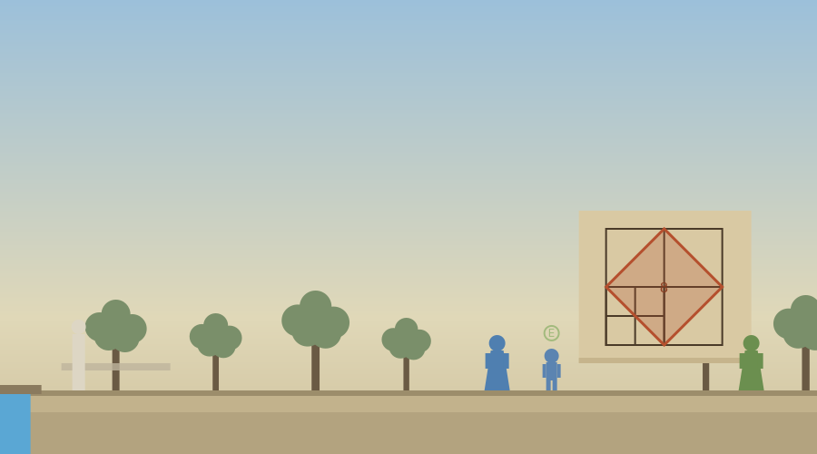

# The Academy of Plato

A single-file walking activity set in the grove of Akademos during the month of the sacred ship, between the trial and the last day. The player walks out through the northwest gate to the grove, meets the young note-taker from the trial, now introduced with his brother Glaucon, and takes the answerer's place in the geometry lesson from Plato's Meno, drawn step by step in the sand. Everything is contained in `academy_of_plato.html`.



## The afternoon

Stage 0 asks the framing question on the road: can a person come to know something that nobody teaches them?

At the sand, Plato explains what he is doing and why: Socrates is in the prison until the ship returns, and this lesson, which Socrates once gave in Meno's courtyard, says more about him than the trial did. Plato plays the questioner and the player plays the answerer, under one rule, answer only what you actually see. The lesson then runs as the Meno runs it, with the diagram drawing itself in the sand as the dialogue advances. The base square with its middle lines, counted to four square feet. The challenge: a square of eight. The player answers the classic question themselves, and whichever guess they give, doubling the side, trying three feet, or admitting uncertainty, the sand tests it: sixteen, then nine, and no whole number lands on eight. The aporia moment is stated in Socrates' own image, the numbing sting, and Stage 1 asks whether the stung answerer is better or worse off than the confident one.

The construction follows visually: the four-foot square cut into four, the diagonals drawn across each, the tilted square standing on its points, and the count, four halves of four, eight, with the player saying the answer before it is stated, exactly as the boy did. The background box gives the source and the stakes plainly: the lesson was given historically to a boy enslaved in Meno's household, Socrates concluded the boy recollected knowledge his soul already possessed, the doctrine called anamnesis, and many readers since have drawn the smaller conclusion that well-chosen questions can teach, which is enough to found a method on. Stage 2 asks what actually happened at the sand, with recollection, disguised teaching, fresh reasoning, and undecidability all on the table.

Glaucon then raises Meno's paradox, that you cannot search for what you do not know, and Plato answers that the lesson is the reply or it is nothing: the search the paradox calls impossible plainly happened. Stage 3 asks whether the lesson answers the paradox, including the objection that the guide already knew.

The close looks forward in Plato's voice, no fees and no answers handed across like coins, and the background box states the history: the school founded here around 387 BC, the centuries of successors, the word academy still carrying the grove's name, and the geometry inscription reported by late sources with the caution historians attach to it. Stage 4 is the one required written answer: what a school should be for, and one thing the student came to understand by being questioned rather than told.

The end screen carries discussion questions on modern innateness cases beside Plato's claim, on how real researchers search for what they cannot yet describe, and on rewriting one of the lesson's questions to teach less and test more, plus a three-item quiz and the report download, which records the answers the player gave at the sand. On completion the activity writes the key `phil_map_academy`. The next stop is The Allegory of the Cave, where the same young man sets down his tablet and asks the player to imagine the prisoners.

## Deployment

```html
<p style="text-align:center;">
  <iframe src="https://YOURUSER.github.io/YOURREPO/academy/academy_of_plato.html"
          width="960" height="1000"
          style="border:1px solid #ccc; border-radius:8px; max-width:100%;"
          title="The Academy of Plato"></iframe>
</p>
```

## Editing guide

The five stage questions are the `prompts` object. The afternoon's conversations are `dlgPlato`, `dlgLessonA`, `dlgLessonB`, `dlgParadox`, and `dlgClose`, advanced by `nextBeat` from the place beside the sand. The diagram is drawn by `drawDiagram` from the `diagramStage` variable, which dialogue cards and choices set with a `diag` field, so the sand always shows what is being discussed. The player's guesses are recorded in `record.guesses` and printed in the report.

## Accessibility

Objective and status lines are announced through live regions, everything is reachable by keyboard, dialogue replies have number-key equivalents, touch controls appear on coarse-pointer devices, narration is available for the reflection prompts, multiple choice questions are answered with a single selection plus an optional comment, and reduced motion is respected.


## Background notes and further reading

Historical and contextual notes no longer interrupt the activities as automatic cards. Each activity now has a collapsible panel under the dialogue, labeled Background and further reading, that starts with curated outside links, Stanford Encyclopedia of Philosophy articles and free full texts of the primary sources, and collects the activity's background notes as the student reaches them, to open and close at their choosing.

## Suggested further reading

The activities themselves carry no outside links, so nothing in them can break or lead a student off task. These are for you, and for any student who wants to go further.

- [Plato, Meno, full text (Project Gutenberg)](https://www.gutenberg.org/ebooks/1643)
- [Plato](https://plato.stanford.edu/entries/plato/)
