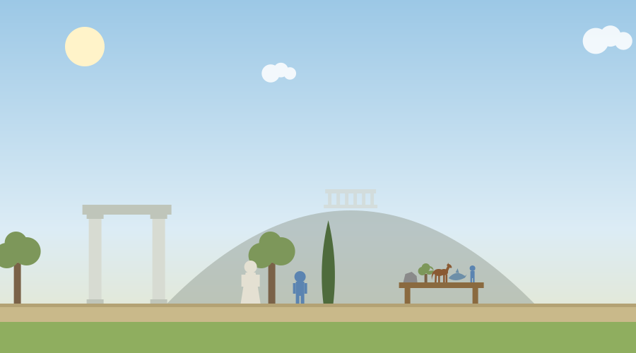
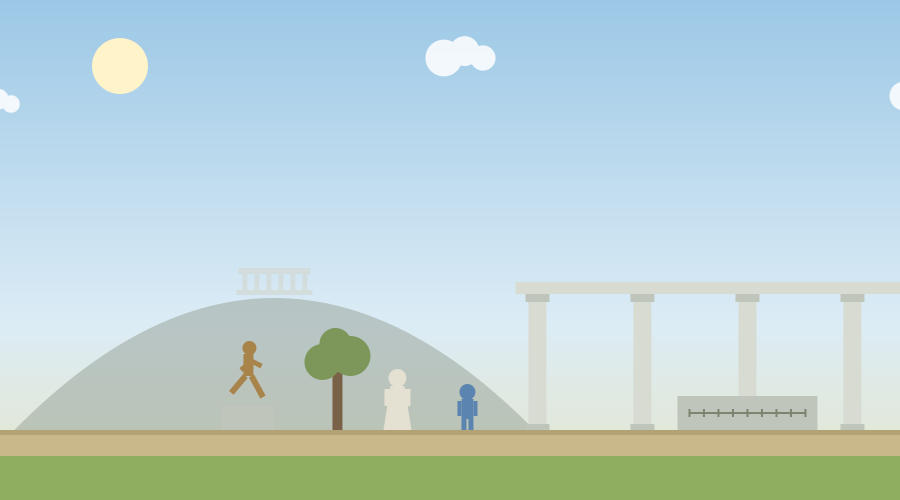

# Aristotle at the Lyceum

A single-file browser game for introductory philosophy and humanities courses. The player visits Aristotle's school in Athens and works through three of his tools in order: classification by capacities at a sorting bench, the four causes at a bronze statue, and virtue as a mean on an interactive line. Aristotle walks the colonnade alongside the player, in keeping with the peripatetic habit the school was named for. The activity records the player's answers at five reflection stages and produces a downloadable report for submission.

No installation, accounts, or internet connection are required beyond loading the page. Everything is contained in `aristotle_lyceum.html`.



## How the visit runs

Stage 0 opens before the player can move. It asks what makes a human life go well, with choices drawn from Nicomachean Ethics book 1: pleasure, honor, wealth, excellent activity of the soul across a whole life, or something else, plus a written reason. The answer is recorded and revisited at the end.

Aristotle greets the visitor inside the gate. He credits Plato and then states his own difference plainly: he studies the things in front of us. From that point on he follows the player from station to station.

Before each station a background box, visually distinct from character dialogue and labeled Background, frames the philosophical issue about to be introduced: capacities and soul before the bench, the four causes and form before the statue, and virtue as a practiced disposition before the line of the mean.

Station 1 is the sorting bench. Five specimens stand on it: a stone, an olive tree, a horse, a dolphin, and a citizen of Athens. The panel asks about each in turn: does it nourish itself and grow, does it perceive, does it reason. Answers that get the specimen wrong receive a correction from Aristotle and the question is asked again, so the bench cannot be completed by guessing. Each placement fills in a drawn tree that ends at four leaves: without soul, plants, animals, and rational, and only the citizen reaches the last leaf. When the bench closes, the activity confronts what Aristotle did with his own definition. A background box states plainly that he held a woman's reason to lack authority and defended slavery as natural, and that his authority was cited for centuries to restrict who counts as rational. The player then challenges him in dialogue, and his replies turn his own method against him: the bench asks only what a being can do, so judged by his own test, reason belongs to everyone. The exchange is recorded in the report. The Stage 1 question then asks the player to define one thing from their own life by genus and differentia. The opening conversation also covers Aristotle's years in Macedon as tutor to the young Alexander, with a background box on the specimen shipments later writers attributed to the campaigns, and the closing conversation states what the connection cost: after Alexander's death, Athens charged Aristotle with the charge once brought against Socrates, and he left rather than let the city sin twice against philosophy.

Station 2 is the statue of a runner in the garden. The conversation asks four questions, one per cause, each with a right answer and a tempting wrong one. Wrong picks are corrected in character and the right answer is stated, so every player leaves with all four causes named: material, formal, efficient, and final. After the formal cause, Aristotle makes the form concrete with the melting case: melt the statue down and every gram of bronze remains but the statue is gone, so the material and the form are different, and both are present in the one object. The choices are recorded in the report. The Stage 2 question asks the player to give the four causes of an object near them right now.

Station 3 is the line of the mean in the colonnade. Three situations appear in turn: facing danger, giving money, and anger at a wrong done to a neighbor. For each, the player moves a marker along a nine-position line between two named extremes and chooses a response. After the choice, Aristotle gives feedback and the panel shades the zone where he places the mean. The first two situations put the mean in the middle band. The third does not: the right response to the cheating shopkeeper sits near the strong end of the line, which is the point of the station. The mean is relative to the situation, not the arithmetic middle. The Stage 3 question asks the player to describe one of their own traits as a mean between an excess and a deficiency.

The closing bench ties the sequence together. Aristotle names the road the player has traveled, through Miletus and the cave, keeps what was right in each, and states his own position: the forms of things live in the things, and the good life is a practice. Stage 4 then reopens the Stage 0 question. Keeping the original answer and changing it both earn full credit, and the prompt says so.

The end screen shows all recorded responses, three discussion questions, a three-item quiz with immediate grading, and a button that downloads the full report as a text file. The third discussion question asks which of the three approaches, Miletus, the cave, or the Lyceum, the student finds most convincing, which makes it a natural short-writing bridge across the whole unit.



## Controls

Move with the left and right arrow keys and jump with the up arrow. E talks and examines, and advances dialogue. Dialogue replies can be clicked or chosen with number keys. The two panels are operated entirely with buttons. On touch devices an on-screen pad appears automatically. A narration toggle reads the reflection prompts aloud using the browser's speech synthesis. The game respects the reduced-motion system setting.

## The report

The downloaded text file contains every stage prompt with the player's choice and written response, the placement of all five specimens on the sorting bench, the four answers given at the statue, the chosen response for each of the three mean situations, the three discussion answers, and the quiz answers with the correct answers and score. Grading on the written portions is by effort and engagement, since the file is plain text and editable.

On reaching the end screen the game also writes a completion key (`phil_map_aristotle`) to the browser's local storage, which the activity map uses to unlock the next stop. If storage is unavailable the game runs normally without it.

## The unit reflection

Because the Lyceum is the last stop of the Ancient Greece unit, the activity ends with one additional required question before the end screen: looking across the whole journey, the student names two ways the unit's ideas and practices, demanding reasons and definitions, testing claims against observation, arguing both sides, public debate, citizen juries, contributed to what later became the sciences and the humanities, and then names the contribution that matters most in their own field.

## Deployment

Upload the file to any static host. For GitHub Pages, place it in a repository with Pages enabled and link or embed the resulting URL:

```html
<p style="text-align:center;">
  <iframe src="https://YOURUSER.github.io/YOURREPO/aristotle-lyceum/aristotle_lyceum.html"
          width="960" height="1000"
          style="border:1px solid #ccc; border-radius:8px; max-width:100%;"
          title="Aristotle at the Lyceum"></iframe>
</p>
```

In Canvas, paste the embed code into a page using the HTML editor. Give the iframe generous height so the dialogue box below the game window is visible without scrolling inside the frame.

## Editing guide

The file is organized in labeled sections. The most likely edits:

- The background boxes are dialogue steps marked `note: true` at the start of `dlgSortIntro`, `dlgStatue`, and `dlgMeanIntro`, and their styling is the `#dialogueBox.note` rule. The challenge conversation after the bench is `dlgSortChallenge`.
- The five stage questions live in the `prompts` object near the top. Each has a title, body text, optional multiple-choice options, and a flag for requiring written text.
- The specimens on the sorting bench are the `SPECIMENS` array. Each entry is a name plus three booleans: grows, perceives, reasons. Adding a sixth specimen is one line, and the bench and tree adjust. The corrections for wrong answers live in `answerSort`.
- The three mean situations are the `MEAN_SCENARIOS` array. Each has a name, a virtue, two end labels, a situation text, five zone descriptions from deficiency to excess, and the index of the ideal zone. Changing the wording of any zone, or moving the ideal, is a direct edit here.
- The four-causes conversation is `dlgStatue`, and the closing conversation is `dlgClose`.
- The quiz questions are in the end-screen markup, and the answer key is the `quizKeys` array.

## Accessibility

Objective and status lines are announced through live regions. All interactions are reachable by keyboard, dialogue replies have number-key equivalents, panels are button-operated, touch controls appear on coarse-pointer devices, narration is available for the reflection prompts, multiple choice questions are answered with a single selection plus an optional comment, and reduced motion is respected.

## Suggested further reading

The activities themselves carry no outside links, so nothing in them can break or lead a student off task. These are for you, and for any student who wants to go further.

- [Aristotle](https://plato.stanford.edu/entries/aristotle/)
- [Aristotle's Ethics](https://plato.stanford.edu/entries/aristotle-ethics/)
- [Aristotle, Nicomachean Ethics, full text (Project Gutenberg)](https://www.gutenberg.org/ebooks/8438)
