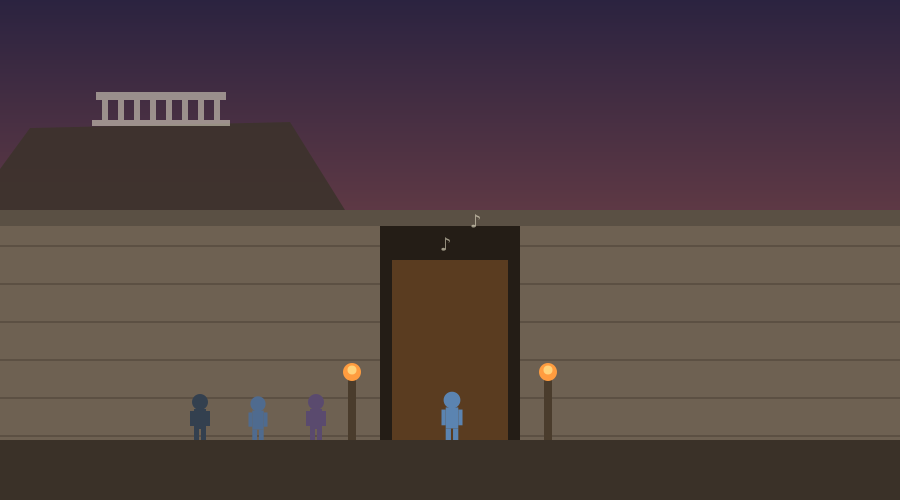
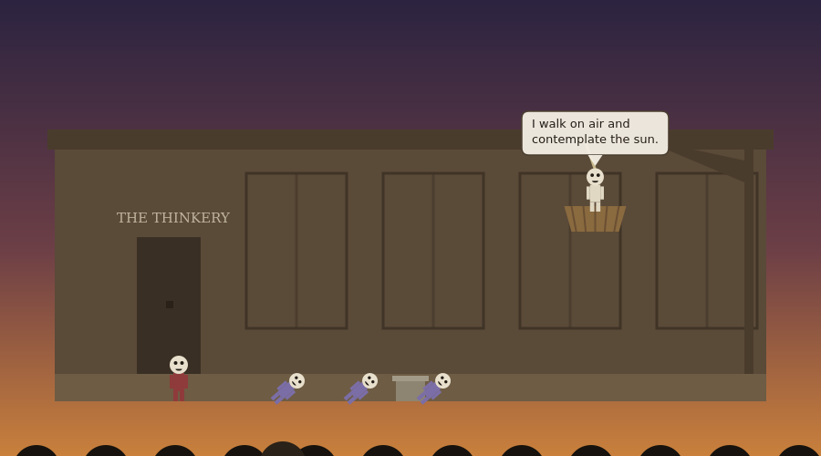

# The Clouds of Aristophanes

A single-file activity that brings the player, home in Athens ahead of their jury service, to the Theater of Dionysus in 423 BC for Aristophanes' comedy The Clouds, the play that taught Athens to laugh at its philosophers. It opens outside the theater with the background, then the player walks in with the arrow keys, climbs the seating tiers, and takes the one open place, arriving late with the play already under way. From the seat, an abbreviated version of the play itself performs in adapted lines, one speaker per card, each line popping up as a speech bubble over the actor on stage, with one in-play vote and a recorded question between the acts. The gaps between the acts are covered in character: a neighbor in the next seat catches the player up on what they missed, and a vendor selling figs and watered wine covers the jump to the debate. It ends on the walk home with a quiet cameo: the real Socrates, barefoot and unmasked, standing apart from the laughing crowd, so the player sees both the image and the man in one evening. Everything is contained in `the_clouds.html`.



## The evening

The opening scene stands outside the theater's outer wall at dusk, the Acropolis a flat-topped crag off to one side behind it, lamplight in the entrance passage and music already drifting out, and sets the stakes: at the City Dionysia, comedy is the city thinking out loud about itself, and half the audience has personally seen the play's target asking questions in the agora. Stage 0 asks what people who have never studied philosophy picture when they imagine a philosopher, and where that picture comes from. Then the player enters and finds a seat: an interactive climb up the tiers, past the seated crowd, to the one marked open place, with the stage visible below and the play already going.

Having missed the opening, the player joins the play at the Thinkery: Strepsiades pounding on the school door, a student explaining that the bent-over scholars are investigating what lies beneath the earth while their backsides learn astronomy, and Socrates swinging overhead in his basket, explaining in his own adapted lines that he walks on air and contemplates the sun. The acts perform as dialogue, speaker by speaker, each line appearing in a speech bubble over the speaking actor, and with narration turned on each character reads in a distinct voice. A background box separates the caricature from the man: the real Socrates hung in no basket, took no fees, and ran no school, and Aristophanes has bundled him together with the nature-theorists and the paid sophists under one famous face. Stage 1 asks which exaggeration in the portrait does the most damage, with the four candidates as options.

The second act is the agon. The Right Argument speaks for the education that raised the men of Marathon, the Wrong Argument boasts in its own voice that it was first to devise how to argue against the just cases and that this is worth more than ten thousand coins. Before the outcome, the player is asked to call the winner, and the call is recorded. The Wrong Argument wins, the Right Argument defects, and the theater roars. Stage 2 asks the player to find the same trick in their own world: one place where the weaker argument is made to appear the stronger, and the device that does it, which makes the stage a direct bridge to critical thinking coursework.

The third act delivers the play's ending in its own lines: Pheidippides proves that beating his father was just and promises the argument holds for his mother next, and Strepsiades takes a torch to the roof, answering the cry from inside with the play's callback, that he is walking on air and contemplating the sun, as the school burns and the audience laughs. Stage 3 asks how much responsibility a comic writer bears for what an audience comes to believe. The historical connection to the trial of 399 BC is made in the trial activity, where it belongs, with Socrates answering the old comedy from the speaker's stone.



The final scene follows the crowd out into the torchlit dark, where the real Socrates stands apart in a plain cloak, unmasked among the masks, answering a heckler with a question. Stage 4 asks, after an evening spent watching a false image of a real man and then passing the man himself, what it takes to tell an image of a thing from the thing itself, which is a question the journey returns to.

The end screen names the next stop, shows all recorded responses, offers three discussion questions on modern caricature, deserved mockery, and mocking a friend's ideas, a three-item quiz, and the downloadable report, and writes the completion key `phil_map_clouds`.

## The actors

Every on-stage performer wears the oversized pale mask of Greek comedy, drawn explicitly as a mask with dark eyes and mouth, and all bodies throughout are in stylized costume colors, so no figure reads as any particular race.

## Deployment

```html
<p style="text-align:center;">
  <iframe src="https://YOURUSER.github.io/YOURREPO/clouds/the_clouds.html"
          width="960" height="1000"
          style="border:1px solid #ccc; border-radius:8px; max-width:100%;"
          title="The Clouds of Aristophanes"></iframe>
</p>
```

## Editing guide

The five stage questions are the `prompts` object, and all narration and play dialogue is the `SCENE_CARDS` array, one list per scene with the seat-finding scene empty, `note: true` marking background styling, and the agon vote embedded as a `choices` card. The open seat's position is `SEAT_X` and the tier geometry is `stepY`. The scene drawings are `drawExterior`, `drawFindSeat`, `drawBasketScene`, `drawAgonScene`, `drawFireScene`, and `drawCaptureScene`, with the stage set built in `drawStage`, the speech bubbles in `drawBubble` and `bubbleAnchor`, and the per-character narration voices in the `VOICES` map. The quiz is in the end-screen markup with its key in `quizKeys`.

## Accessibility

Scenes only advance on the student's click, the seat can be reached by keyboard or by tapping the canvas, narration cards can be read aloud with the narration toggle, the reduced-motion setting stills the basket's sway and the flames, dialogue choices have number-key equivalents, and multiple choice questions are answered with a single selection plus an optional comment.

## Suggested further reading

The activities themselves carry no outside links, so nothing in them can break or lead a student off task. These are for you, and for any student who wants to go further.

- [Aristophanes, The Clouds, full text (Project Gutenberg)](https://www.gutenberg.org/ebooks/2562)
- [Socrates](https://plato.stanford.edu/entries/socrates/)
