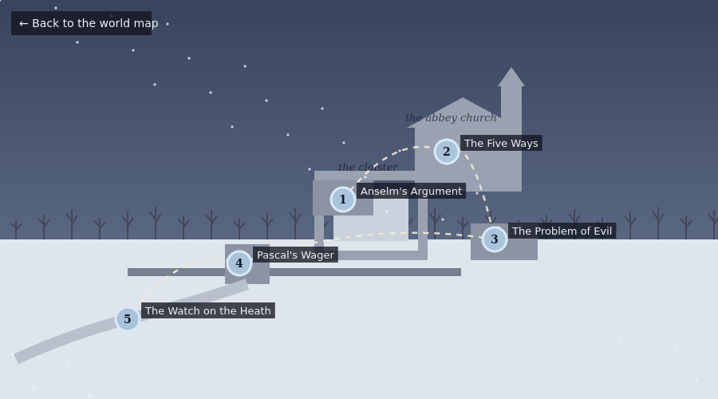
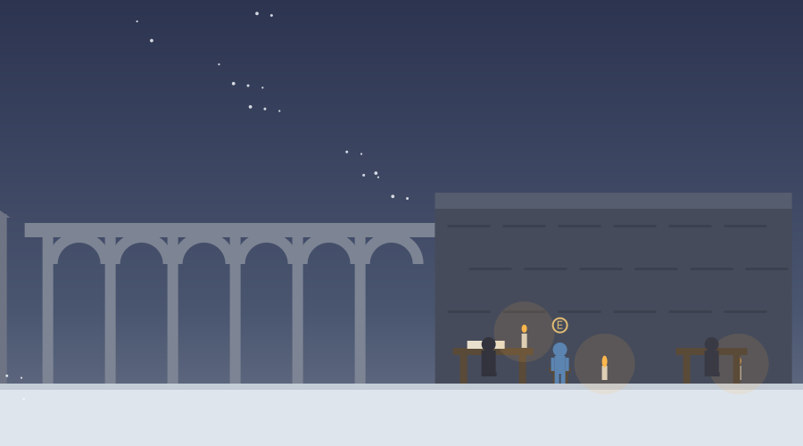

# The Monastery

The second region of the journey, and a unit on arguments about God, set at an abbey in Normandy in winter. This folder holds the region map, `monastery_map.html`, and the unit's first activity, `anselm_argument.html`. The region map's header says plainly that the unit's stops jump across centuries on purpose, organized by their question rather than by their dates, with each activity stating its real time and place.



## The region map

Five stops, in order: Anselm's Argument in the scriptorium, The Five Ways in the abbey church, and The Problem of Evil in the infirmary, all live now, then two in preparation: Pascal's Wager at the gatehouse table, and The Watch on the Heath on the road beyond the gate. The map draws the abbey in snow, church and tower, cloister, scriptorium range, infirmary, gatehouse, and the road out, with the dashed route between the stops and a corner button back to the world map. Completion keys: `phil_map_anselm`, `phil_map_aquinas`, `phil_map_evil`, `phil_map_pascal`, `phil_map_paley`.

# Anselm's Argument

A single-file walking activity set at the abbey of Bec in 1078. The traveler arrives at dusk in the snow, is let in by the porter, and takes the stool beside the prior, Anselm, who has just finished the Proslogion and wants his new proof walked before it is trusted.



## The evening

Stage 0 asks, before anything is heard, whether the existence of anything can be settled by thought alone, with mathematics offered as the tempting comparison.

The center of the activity is the argument itself, walked step by step, and at each step the player chooses to grant it or resist it. Resisting never blocks the argument: Anselm answers the resistance in character, asks the player to hold the doubt, and continues, and every grant and resistance is recorded and printed in the report. The steps, in adapted wording from Proslogion 2 and 3: the definition, that than which nothing greater can be thought; existence in the understanding, which even the Psalms' fool has; the supposition of existence in the understanding alone; that existing in reality as well is greater; the contradiction; and the conclusion. A background box names the argument's family, a priori, reasoning from concepts alone, and notes that nearly every major philosopher since has taken a turn at it. Stage 1 asks where the player would push if they had to resist somewhere, with "nowhere" and "everywhere at once" both available.

Then the day's mail arrives, and it is historical: Gaunilo of Marmoutier's reply, On Behalf of the Fool, with the most excellent island run through the same steps, and Anselm reads it aloud with evident pleasure. The background box records that Anselm had the objection copied together with the Proslogion at his own request, so readers would always meet the argument beside its best early critic. Stage 2 asks whether the parody breaks the argument, with the burden-shifting reading among the options.

Anselm's answer follows: the proof bites on one subject only, a being whose nonexistence cannot be thought, and no island is like that, since whatever has limits can be thought away. Stage 3 asks whether the idea of a necessary being makes sense, including the option of following the words without being sure they describe a possibility.

The close gives the argument its historical frame in Anselm's own order: he believed first, and the belief kept asking to be understood, which is what faith seeking understanding means. Stage 4 is the one required written answer: what role arguments like this should play in religious belief, answered for believers and for nonbelievers.

The end screen carries three discussion questions, Kant's existence-is-not-a-predicate objection stated for the student to explain and judge, whether an argument has ever changed a belief of theirs, and what the Anselm-Gaunilo exchange suggests about defending a belief against testing one, plus a three-item quiz and the report download, which includes the full list of granted and resisted steps. On completion the activity writes the key `phil_map_anselm`.

# The Five Ways

A single-file walking activity in the abbey church, and the region's stated time-jumping in action: the header says plainly that two centuries have passed, it is around 1270, and the visiting Dominican is Thomas Aquinas. His opening conversation sets him against the region's first stop directly, in his own historical position: he honors the prior of Bec and does not follow him, because a proof for us must start from effects we can observe, and the background box states his rejection of Anselm's style of proof from the opening of the Summa.

The activity is a walk through the church with five marked stations, one Way at each, argued from a thing the player is looking at. The bell rope pulled and answered is the argument from motion. A candle lit from a candle is the argument from efficient causes, and Aquinas notes aloud that he has said nothing yet about who or what the first cause is. Stage 1 falls between them and after them: is an infinite regress of causes actually impossible, with the objection available. The memorial slab in the floor carries the argument from contingency to a necessary being, and its background box ties the region together: Aquinas reaches by observation the same necessity Anselm reached by definition, opposite roads to one destination. The light coming through the windows at visibly different strengths carries the fourth Way, from degrees to a maximum, with Aquinas admitting in character that this is the Way his students fight hardest, and Stage 2 asks whether more and less implies a most. The swallows' nests above the garth door carry the fifth Way, from things without knowledge acting for ends, and Stage 3 confronts the closing phrase of all five: and this all understand to be God, asking what, if anything, the Ways prove about the God of prayer and worship. The friar's last word draws the line himself: reason walks to a first cause on its own legs, and no further, and he never claimed otherwise. Stage 4 is the required written verdict, the strongest Way and the weakest, with a reason for each.

The end screen's discussion questions carry the whole-series objection later pressed by Hume and Russell, the bearing of modern cosmology, and the gap problem, plus a three-item quiz and the report download. On completion the activity writes the key `phil_map_aquinas`.

# The Problem of Evil

A single-file walking activity in the infirmary on the same winter night as the Five Ways, hosted by the infirmarer, the monk who nurses the sick, who has heard the scriptorium's proof and the church's proofs and asks his question where he works. The header warns plainly that the scenes concern illness and loss, handled with restraint, and they are: nothing graphic appears at any bed.

The walk runs bed to bed. At the first bed, a brother with a fever nobody caused, the problem is stated in its oldest reported form, the trilemma from Epicurus, and Stage 1 asks which horn the student would contest. At the second bed, a traveler hurt by robbers who chose to hurt him, the free will defense gets its best case and its two standing limits, stated at the bedside where each limit is visible: the fever no one chose, and Mackie's question about free creatures who always choose well, with Stage 2 asking how far the defense reaches. At the window, looking out at the snow rather than at a bed, the soul-making theodicy and Leibniz's best possible world are given fairly, and then Rowe's fawn is told as the picture it is, with the background box crediting Irenaeus and Hick, Leibniz and Voltaire, Rowe's 1979 argument, and the skeptical theist reply. Stage 3 asks which of the three answers is strongest and whether the strongest succeeds, with trust-without-explanation among the options. The last bed holds an old brother, calm and awake, and the infirmarer asks the closing question the only way it ever really arrives: Stage 4 is the required written answer, what the student would say at that bedside, and whether it is the same thing they would say in a classroom.

The discussion questions carry the seminar-versus-bedside distinction, Mackie's question with the best reply the student can construct, and the epistemology of judging suffering pointless in either direction. On completion the activity writes the key `phil_map_evil`.

# Pascal's Wager

A single-file activity at the gatehouse table, with the region's road jumped to around 1660 and the sheltering traveler introduced as Blaise Pascal, dice, coins, and a slate in front of him. The activity earns the wager's mathematics before spending it: the first beat is a two-offer bet the student must price, one chance in six of twelve coins against one chance in two of four, and whichever answer they give, Pascal walks the expectation calculation and names it, so the multiplication is in hand before the theology arrives.

The wager itself fills the slate square by square as the conversation rules it, the way the Academy's sand lesson draws: the grid, the infinite gain, the small loss, the bottom row, and then the expectation argument run with the student's own multiplication, ending with Pascal stating plainly what the wager is not, a proof, and demanding a hostile audit of his own table. Stage 1 is the attack, with the many gods objection, the broken arithmetic of infinity, the zero probability reply, and the belief-is-not-a-coin objection all available. Pascal then raises the strongest objection himself and gives his historical answer on habit and practice, with the background box crediting the Pensees and Diderot's imam. Stage 2 asks whether cultivated belief is real belief or self-management. The gatekeeper's question, whether faith is a bet, draws Pascal's own larger position, the wager as a door and the heart's reasons, and Stage 3 sets Clifford against James by name. Stage 4 is the required construction: the student builds a wager-style argument about a non-religious commitment and identifies one strength and one inherited weakness. The report records the bet priced at the table.

On completion the activity writes the key `phil_map_pascal`.

# The Watch on the Heath

A single-file walking activity on the heath road beyond the gatehouse, with the region's last jump stated in the header. It is around 1800, and the walking companion is William Paley, working out Natural Theology aloud. The walk has four marked spots. At the stone, Paley's actual opening is closely adapted, the answer that it lay there forever is allowed to stand, and the student is told to hold it in hand. At the watch, the case opens across the whole view and the works run while the conversation examines them, toothed wheels turning in mesh, the coiled mainspring, the balance wheel swinging, and a small dial with moving hands, so the word contrivance has something visibly moving under it when it is introduced. The student answers what separates the watch from the stone, and Stage 1 asks whether contrivance proves a contriver. At the stile, Paley himself rehearses the objections his reviewers will bring, crediting them to the Scotsman who printed them all before he took up his pen, the weak analogy, the designer's designer, and the underdetermined workman, with the background box naming Hume's Dialogues of 1779 and the standing question of whether Natural Theology answers them. At the field gate, Paley states the concession that history will collect, show me a mindless process that shapes an eye and I will surrender the living world to it, and the background box supplies Darwin, 1859, and the two lines the debate has run along since. Stage 4 asks for the strongest version of design reasoning available today, and a verdict on it.

On completion the activity writes the key `phil_map_paley`, which completes the Monastery.

## Deployment

```html
<p style="text-align:center;">
  <iframe src="https://YOURUSER.github.io/YOURREPO/monastery/anselm_argument.html"
          width="960" height="1000"
          style="border:1px solid #ccc; border-radius:8px; max-width:100%;"
          title="Anselm's Argument"></iframe>
</p>
```

The region map deploys the same way from `monastery/monastery_map.html`, and the world map at `map/world_map.html` links to it with relative paths, so keeping the folder layout keeps the links working.

## Editing guide

The five stage questions are the `prompts` object. The evening's conversations are `dlgPorter`, `dlgArgument`, `dlgLetter`, `dlgReply`, and `dlgClose`, advanced by `nextBeat` from the stool. The grant-or-resist choices are built by the `grantResist` helper, and the record of them lives in `record.granted` and `record.resisted`. The snow is the `flakes` array, excluded from the roofed sections in `render`.

## Accessibility

Objective and status lines are announced through live regions, everything is reachable by keyboard, dialogue replies have number-key equivalents, touch controls appear on coarse-pointer devices, narration is available for the reflection prompts, multiple choice questions are answered with a single selection plus an optional comment, and reduced motion is respected, including the snowfall and the candle flames.


## Background notes and further reading

Historical and contextual notes no longer interrupt the activities as automatic cards. Each activity now has a collapsible panel under the dialogue, labeled Background and further reading, that starts with curated outside links, Stanford Encyclopedia of Philosophy articles and free full texts of the primary sources, and collects the activity's background notes as the student reaches them, to open and close at their choosing.

## Suggested further reading

The activities themselves carry no outside links, so nothing in them can break or lead a student off task. These are for you, and for any student who wants to go further.

- [Ontological Arguments](https://plato.stanford.edu/entries/ontological-arguments/)
- [Saint Anselm](https://plato.stanford.edu/entries/anselm/)
- [Anselm, Proslogion, full text (Fordham Sourcebooks)](https://sourcebooks.fordham.edu/basis/anselm-proslogium.asp)
- [Cosmological Argument](https://plato.stanford.edu/entries/cosmological-argument/)
- [Saint Thomas Aquinas](https://plato.stanford.edu/entries/aquinas/)
- [Aquinas, Summa Theologiae, on God's existence (New Advent)](https://www.newadvent.org/summa/1002.htm)
- [The Problem of Evil](https://plato.stanford.edu/entries/evil/)
- [Pascal's Wager](https://plato.stanford.edu/entries/pascal-wager/)
- [Pascal, Pensees, full text (Project Gutenberg)](https://www.gutenberg.org/ebooks/18269)
- [Teleological Arguments for God's Existence](https://plato.stanford.edu/entries/teleological-arguments/)
- [Hume, Dialogues Concerning Natural Religion, full text (Project Gutenberg)](https://www.gutenberg.org/ebooks/4583)
- [Darwin, On the Origin of Species, full text (Project Gutenberg)](https://www.gutenberg.org/ebooks/1228)
