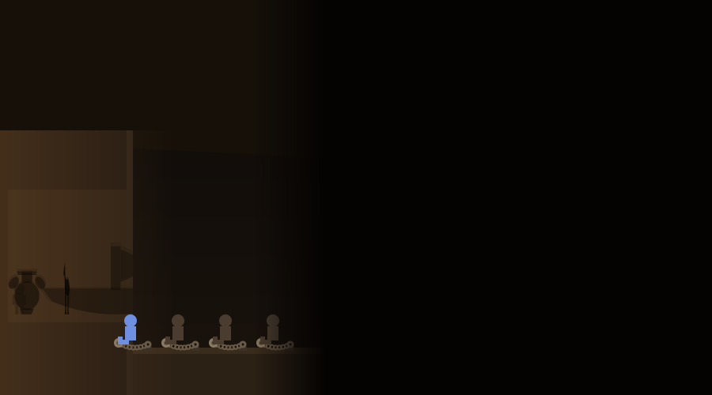
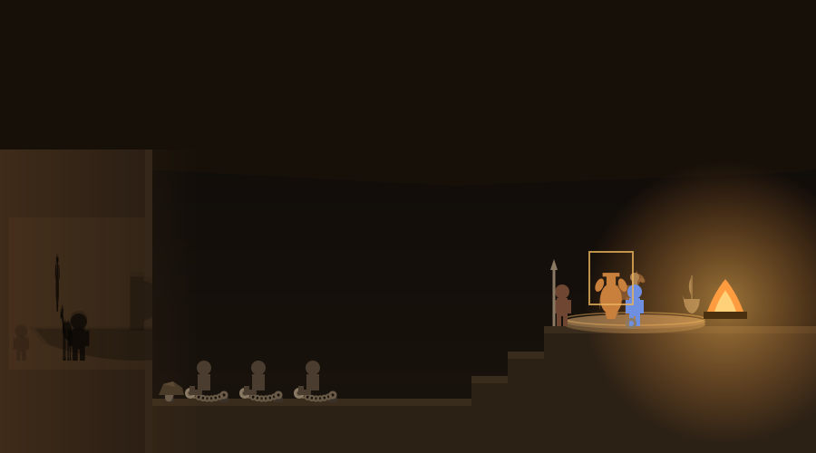
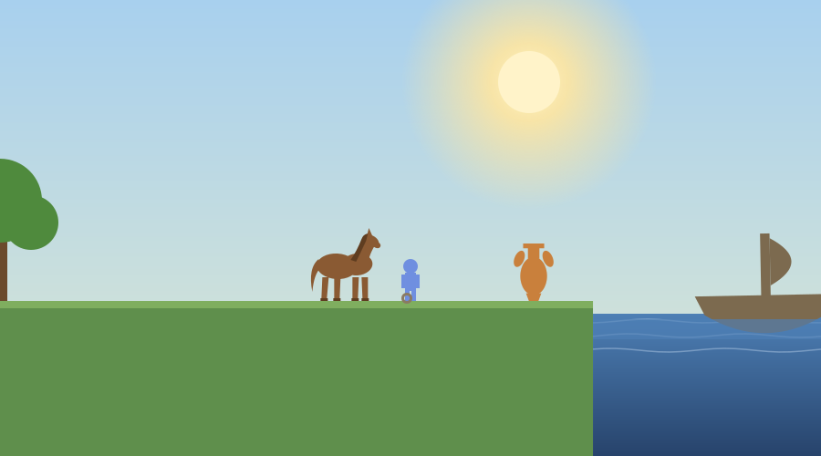

# The Allegory of the Cave

A single-file browser game for introductory philosophy and humanities courses. Students play a prisoner in the cave described in Book 7 of Plato's *Republic*, moving through the full arc of the allegory: chained before the wall, freed, up to the fire, out into daylight, and back down to attempt a rescue. At five points the game pauses for a written reflection, and at the end students answer discussion questions, take a short quiz, and download a plain-text report of everything they wrote and did.

The game is one HTML file with no external dependencies, so it runs from any static host and works offline once loaded.

## What students do

Stage 0. The player begins chained in the leftmost seat, closest to the wall, beside three other prisoners. Everything beyond the wall is hidden in darkness. Silhouettes cast by objects on a turning platform slide across the wall, and the first reflection question asks what the moving shapes are.

Stage 1. A rock falls from the ceiling and breaks the player's chain. The view widens to reveal the whole cave. Walking toward the steps starts a conversation with a prisoner who insists the shapes on the wall are the only real things, followed by the second reflection question.

In the journey sequence, this activity sits inside the month between the verdict and the execution, while the sacred ship is at sea. The young note-taker from the trial, Plato, meets the player in the grove of Akademos and asks them to imagine themselves chained, exactly as the Republic will one day ask its readers, and the imagined story becomes playable. Historically the Republic was written a generation later: the journey compresses the timeline on purpose, and the map's README states the real dates.

Stage 2. At the top of the stairs a guard is waiting. He was not prepared for a freed prisoner, so he keeps his eye on the player: they may inspect the objects on the turning carousel, pick them up, turn them with R, and watch the shadows they cast respond on the wall in real time. The objects turn with the platform as they ride it, so their profiles narrow, flip, and widen. The fire lights them from the side, a quarter turn out of phase with the viewer, so the wall never shows the profile the player is looking at: when the horse faces the player fully, its shadow is a thin slab, and when it turns edge on, the wall shows the full horse. Shadows also grow as their objects near the fire, up to swallowing much of the wall, and stretch, thin, and fade off toward the edges of the lit patch, exactly as the chained prisoner later describes. However, but any attempt to carry an object away from the platform ends with the guard confiscating it. The player also casts their own shadow while standing between the fire and the wall. Completing the inspection opens the third reflection question. The upper passage stands open the whole time: a player who heads out early gets one comment from the guard and nothing more, and can come back for the fire afterward.

Stage 3. The player jumps the fire, climbs the tunnel, and is briefly dazzled by daylight. Outside, the real things whose silhouettes played on the wall are alive and indifferent: a horse grazes and wanders and can be petted, an amphora tips and chips if walked into but is far too heavy to lift, and a large ship bobs on the water that ends the world to the east. Stepping into the water gets the player wet and turned back. The fourth reflection question asks them to compare what they see with what they believed inside.

Stage 4. Back in the cave, the player attempts to persuade the prisoners through a branching dialogue. Assertion fails. A questioning approach, an offer of one small testable step, and then an actual demonstration at the fire ledge, performed while the prisoner watches the wall, can persuade exactly one prisoner to rise. The majority refuses in every case. After any failed attempt the player chooses to keep trying or to give up, and the final reflection question adapts to the outcome.

## Controls

Move with the left and right arrow keys and jump with the up arrow. E talks, picks up, and puts down. R turns a carried object. Dialogue replies can be clicked or chosen with the number keys. Objects can also be dragged with the mouse. On touch devices an on-screen control pad appears below the game. A Help button in the header restates the current objective and gives a stage-specific tip, and the controls line under the canvas updates as new abilities become relevant.

## The reflection report

The end screen shows every stage response, and the downloadable report adds an activity record: whether the fire ledge task was completed, whether the optional mid-journey conversation happened, the persuasion choices made and their outcome, whether the demonstration was performed, and small details such as petting the horse. Submission is honor based: students download the text file and submit it in Canvas.

## Deployment

Upload the HTML file to any static host. For GitHub Pages, place it in the repository and link to it directly. Canvas embedding works with a module External URL item with "Load in a new tab" unchecked, or with an iframe pasted into a page in the HTML editor:

```html
<p><a href="https://YOURUSER.github.io/YOURPATH/platos_cave_simulation.html" target="_blank" rel="noopener">Open the simulation in a new tab</a></p>
<iframe src="https://YOURUSER.github.io/YOURPATH/platos_cave_simulation.html" width="100%" height="980" style="border:0;" title="The Allegory of the Cave simulation"></iframe>
```

Keep the open-in-new-tab link above the iframe for phones and screen readers.

## Accessibility

The game is fully playable from the keyboard, shows touch controls on coarse pointers, respects the prefers-reduced-motion setting by damping flicker and drift, and offers optional spoken narration of each reflection prompt through the browser's speech synthesis (a Narration toggle in the header, plus a Play narration button on each prompt).

## Editing

All student-facing text lives near the top of the script in the `prompts` object. Quiz questions are in the end-screen markup and their keys in the `quizKeys` array. Dialogue lines are in the functions beginning `dlg`. The persuasion rule (which choices earn the demonstration) is in `dlgPhase2`, and the fire-task requirement is in `checkFireTask`.

## Screenshots

Stage 0, chained before the wall. Only the wall and the prisoners are visible, and every silhouette corresponds to a real object on the unseen carousel.



The fire ledge. The guard watches from the top of the stairs while the player carries an object, and the object, the player, and the guard each cast a live shadow on the wall the prisoners face.



Outside the cave. The grazing horse, the amphora, and the ship on the water are the real things whose shadows played on the wall.



## Suggested further reading

The activities themselves carry no outside links, so nothing in them can break or lead a student off task. These are for you, and for any student who wants to go further.

- [Plato, The Republic, full text (Project Gutenberg)](https://www.gutenberg.org/ebooks/1497)
- [Plato](https://plato.stanford.edu/entries/plato/)
