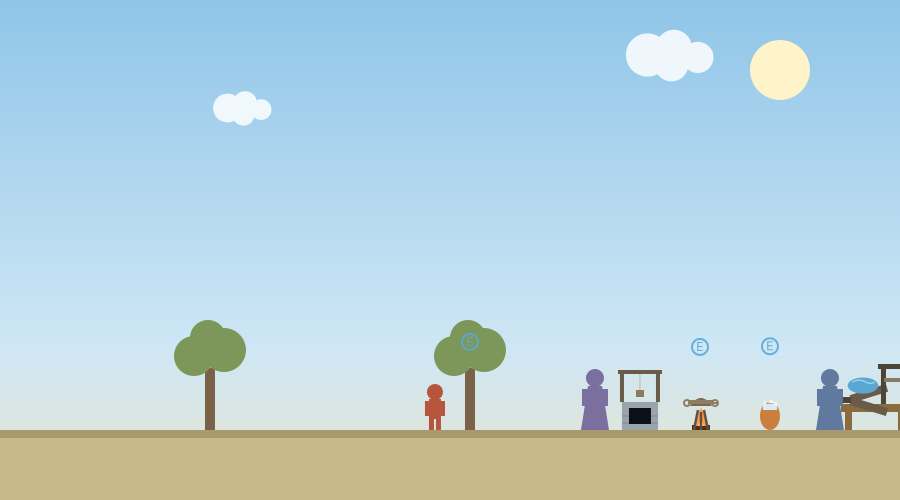
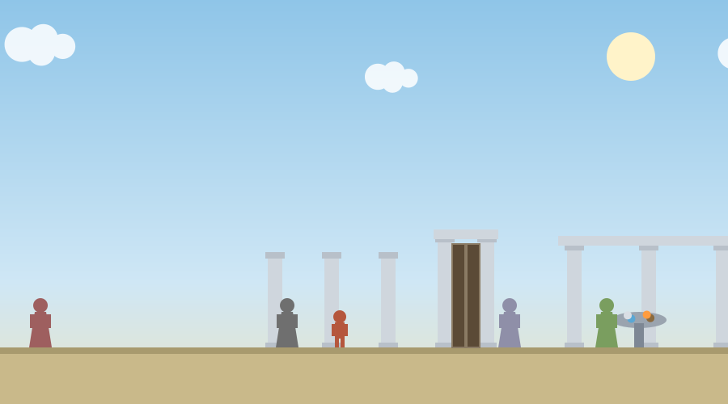
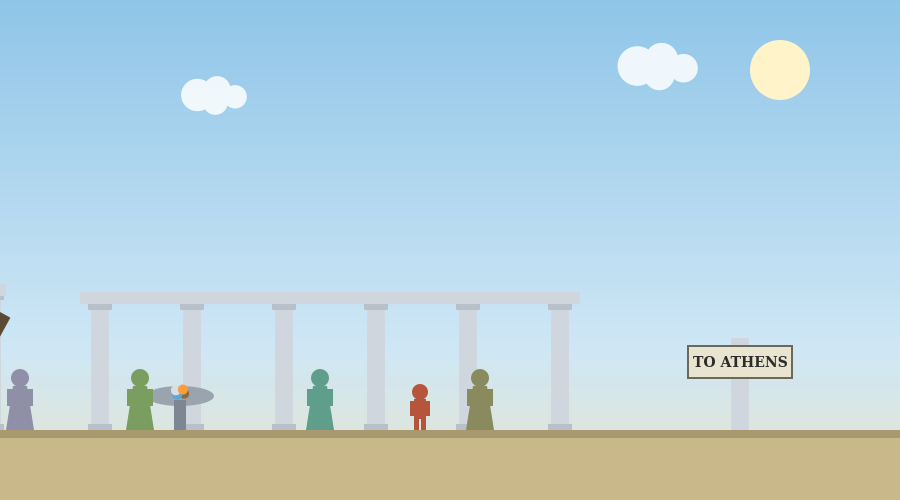

# The Presocratic Philosophers

A single-file browser game for introductory philosophy courses. Students walk a road along the Ionian coast, meet the major Presocratic thinkers in roughly historical order, and test each thinker's central claim with a hands-on device or activity instead of reading a summary of it. The frame is a bring-your-own-first-principle assignment: Stage 0 asks what everything is made of before any philosopher has spoken, and Stage 4 asks the same question again at the end of the road. Keeping the original answer and changing it both earn full credit. The defense is what matters.

The game is one HTML file with no external dependencies, so it runs from any static host and works offline once loaded.

## What students do

Stage 0. The road begins in an olive grove. Before the player meets anyone, the first reflection question asks for their own answer to the first question of philosophy: what is everything made of? The options include water, air, fire, number, tiny indivisible pieces, and something else, plus a written defense.

Stage 1. Thales greets the traveler on approach, states that everything is water, mentions the well he once walked into, and points out three marked spots to examine with E: an olive tree drinking water through its roots, a cauldron thinning water into mist over a fire, and a jar in which water hardened overnight into ice. Anaximenes then stands between the spots and his work bench, will not let the traveler at the device until the spots have been seen, and states his own view before the panel opens. On the bench, the two changes are two different machines: pumping the bellows sends visible puffs of air that thin the material one rung up the ladder, and turning the screw press drives a plate down that squashes it one rung thicker, through stone, earth, water, cloud, wind, air, and fire, with the transformation animated and the ladder labeled. Out in the world, the material's current form stands above the bench as an image rather than a word. The panel closes after at least three forms have been visited, and the Stage 1 question asks whether one underlying material seems able to explain everything.

Between stations, Pythagoras stops the traveler and opens his monochord: one string over a movable bridge. Buttons move the bridge among four positions, the whole string, three quarters, two thirds, and one half, and a Pluck button (or a click on the string itself) sounds the segment through the browser's audio at the true ratios, 1 to 1, 4 to 3, 3 to 2, and 2 to 1, with each interval named. The panel closes after two positions have been plucked.

Stage 2. A river crosses the road. The player wades through it, and through it again, and the water is visibly different at each crossing. Heraclitus then asks whether it was the same river both times, in a choice dialogue, and the Stage 2 question puts the same problem in writing, with a third option available: that the word same needs clarifying before the question can be answered.

Stage 3. In a marble colonnade, walking stops working. Each press of the right arrow covers exactly half of the remaining distance to the gate, with the shrinking count of paces displayed, so the player performs Zeno's dichotomy argument with their own thumb. After six futile presses Zeno explains what they have noticed and offers three replies: accept that the senses deceive, answer that endless steps can still finish in a finite time, or refuse the argument by appeal to having walked there. All three open the gate and all three are logged. Beyond the gate stands Parmenides himself, who delivers the doctrine his student defends: what is, is, nothing comes from nothing, and what truly is was never born and can never perish. The Stage 3 question asks the student to say where the argument fails, or what accepting it would mean.

Stage 4. The stoa of the answerers. Empedocles opens a mixing basin panel: a Love button draws four labeled root piles, earth, water, air, and fire, together into a single compound, and a Strife button pulls them apart again, with the point stated plainly, that coming to be and passing away are only mixing and unmixing. Anaxagoras states that there is a portion of everything in everything and that the sun is a hot stone larger than the Peloponnese. Democritus offers a close look with E that overlays the whole screen with atoms moving in void. The road ends at a large marker pointing to Athens, where a stonemason's son has begun stopping people in the market to ask them questions, and the final reflection asks the student to state their principle again, keep it or change it, and defend it.

## Controls

Move with the left and right arrow keys and jump with the up arrow. E talks, examines, and looks closely. R also opens a device when standing beside one, and the devices reopen with E or R at any time. Device panels are operated with on-screen buttons, so they work identically with a mouse or a touchscreen. Dialogue replies can be clicked or chosen with the number keys 1, 2, and 3. On touch devices an on-screen control pad appears below the game. A Help button in the header restates the current objective and gives a stage-specific tip.

## The reflection report

The end screen shows every stage response, and the downloadable report adds an activity record: the initial principle and the revisited principle, the reply chosen at Zeno's gate, how many spots were examined at the Thales station, how many forms were visited with the bellows, how many bridge positions were plucked on the monochord, the number of river crossings, whether Love and Strife were each used at the basin, and whether the close look with Democritus was taken. Submission is honor based: students download the text file and submit it in Canvas.

## Deployment

Upload the HTML file to any static host. For GitHub Pages, place it in the repository and link to it directly. Canvas embedding works with a module External URL item with "Load in a new tab" unchecked, or with an iframe pasted into a page in the HTML editor:

```html
<p><a href="https://YOURUSER.github.io/YOURPATH/presocratics_journey.html" target="_blank" rel="noopener">Open the journey in a new tab</a></p>
<iframe src="https://YOURUSER.github.io/YOURPATH/presocratics_journey.html" width="100%" height="980" style="border:0;" title="The Presocratic Philosophers journey"></iframe>
```

Keep the open-in-new-tab link above the iframe for phones and screen readers.

One note on sound: the monochord uses the browser's audio, which browsers only allow after a user gesture. The first button press or tap inside the panel satisfies this, so no setup is needed, but if a browser blocks audio the game continues silently and everything else still works.

## Accessibility

The game is fully playable from the keyboard, shows touch controls on coarse pointers, respects the prefers-reduced-motion setting by damping cloud drift, water motion, and device animation, and offers optional spoken narration of each reflection prompt through the browser's speech synthesis (a Narration toggle in the header, plus a Play narration button on each prompt).

## Editing

All student-facing text lives near the top of the script in the `prompts` object. Quiz questions are in the end-screen markup and their keys in the `quizKeys` array. Dialogue lines are in the functions beginning `dlg`. The device panel requirements (three bellows forms, two monochord positions, both basin forces) are checked in `canDeviceClose`, and the number of halving presses before Zeno speaks is the constant compared against `zeno.presses` in the keydown handler.

## Screenshots

The Milesian station. Thales stands by the well he fell into, with the marked examine spots, the cauldron, the jar of ice, and Anaximenes waiting at his bench.



Zeno's colonnade. Each press of the right arrow covers half of the remaining distance to the closed gate, and Parmenides waits beyond it.



The stoa of the answerers. Empedocles with his basin, Anaxagoras, Democritus, and the road marker pointing to Athens.



## Suggested further reading

The activities themselves carry no outside links, so nothing in them can break or lead a student off task. These are for you, and for any student who wants to go further.

- [Presocratic Philosophy](https://plato.stanford.edu/entries/presocratics/)
- [Heraclitus](https://plato.stanford.edu/entries/heraclitus/)
