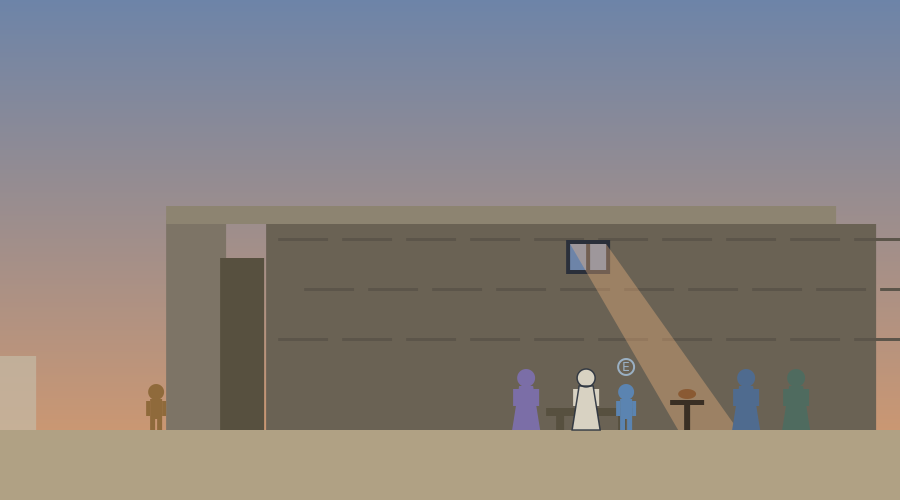

# The Prison of Socrates

A single-file walking activity set on the last day, a month after the verdict. The player, the juror of the trial activity, visits the state prison, hears Crito's escape plan and the answer of the Laws, sits through the afternoon with the circle of friends, and witnesses the evening handled the way Plato's Phaedo handles it, with calm. Everything is contained in `prison_of_socrates.html`.



## The day

Stage 0 opens outside: the player cast a ballot at the trial, the sentence is carried out today, and the question is whether a citizen should obey a verdict they believe is unjust. At the door, the jailer remembers the juror from the benches and explains the date: the ship from Delos came in yesterday. The background box makes the connection that ties the whole unit together, and it is historical: the city holds no executions while its sacred ship is away on the annual mission to Delos, and that mission ship is the state vessel Athens preserved plank by plank, the same ship the journey crossed the Aegean aboard. The delay and the date both come from the Phaedo.

Inside, the wall is drawn cut away, and the player takes the open place among the visitors, from which the day advances one press of E at a time, with the shaft of light from the high window moving and reddening as the phases pass. First Crito, adapted from the dialogue of that name: the money is ready, Thessaly will take him, think of the children, think of what people will say. The player chooses which of Crito's points to press, the choice is recorded, and Socrates answers each before giving the speech of the Laws: born, raised, and married under them, seventy years without leaving, persuade us or obey us, and an escape harms not the jurors who did the wrong but the laws themselves. Stage 1 asks whether a duty to obey wrongly applied laws exists for someone who freely stayed, with the option of rejecting the argument's premise among the choices.

The afternoon passes in the old work, questions about the soul with Cebes and Simmias, and then the activity turns to its sources lesson. One name is missing from the room, and the background box quotes the sentence in which the author of the account records his own absence: Plato, I believe, was ill. Stage 2 asks what an admitted absence does to a source, weakening it, supporting its honesty, or both at once.

Near sunset the jailer delivers his tribute in tears, the man with the cup gives his instructions, and Socrates asks about a libation, settles for a prayer, and drinks without a change of face. The room breaks, he quiets it, walks until his legs grow heavy, lies down, and gives Crito the last instruction: a rooster owed to Asclepius, a debt not to be neglected. The closing line of the Phaedo follows in a background box. Nothing graphic is depicted at any point, matching the restraint of the source. Stage 3 puts the famous interpretive question to the student: Asclepius healed, recovered Greeks owed him offerings, so what was the debt for, with the major readings as options and the open reading among them.

Stage 4 steps outside into the dusk and asks for the only required written answer of the activity: the player cast a ballot in this, so what would they say now, to him or to the city.

The end screen shows all responses, three discussion questions comparing persuade-or-obey with modern civil disobedience, testing residence as agreement, and weighing a self-confessedly absent source, a three-item quiz, and the download, which also records which of Crito's points the player pressed. On completion the activity writes the key `phil_map_phaedo`. The next stop is Aristotle at the Lyceum, which closes the unit.

## Deployment

```html
<p style="text-align:center;">
  <iframe src="https://YOURUSER.github.io/YOURREPO/prison/prison_of_socrates.html"
          width="960" height="1000"
          style="border:1px solid #ccc; border-radius:8px; max-width:100%;"
          title="The Prison of Socrates"></iframe>
</p>
```

## Editing guide

The five stage questions are the `prompts` object. The day's conversations are `dlgJailer`, `dlgCrito`, `dlgSources`, `dlgCup`, and `dlgAfter`, advanced by `nextBeat` from the visitor's place. The passing light is driven by `dayPhase` through the `PHASE_SKY` and `PHASE_SHAFT` tables, and Socrates' posture through `socState`.

## Accessibility

Objective and status lines are announced through live regions, everything is reachable by keyboard, dialogue replies have number-key equivalents, touch controls appear on coarse-pointer devices, narration is available for the reflection prompts, multiple choice questions are answered with a single selection plus an optional comment, and reduced motion is respected.

## Suggested further reading

The activities themselves carry no outside links, so nothing in them can break or lead a student off task. These are for you, and for any student who wants to go further.

- [Plato, Phaedo, full text (Project Gutenberg)](https://www.gutenberg.org/ebooks/1658)
- [Plato](https://plato.stanford.edu/entries/plato/)
