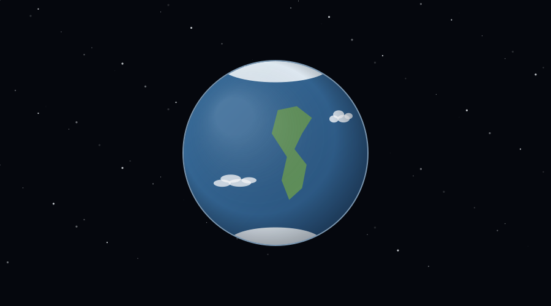
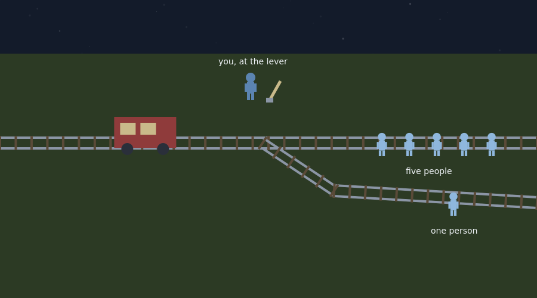

# What Philosophy Is

A single-file introduction to philosophy for the start of the course, and the first stop before the journey map's route begins. Unlike the walking activities, the prologue is a sequence of animated scenes that advance with a Continue button, each framed by narration cards and several ending in a recorded question. Everything is contained in `philosophy_prologue.html`.



## The sequence

The prologue runs through five scenes. It opens on the spinning planet under a starfield, drawn with shaped continents, polar ice, and drifting cloud bands, and the narration states what philosophy is: the craft of taking seriously the questions that no measurement can settle, begun independently in Greece, India, and China. Stage 0 asks which kind of question pulls at the student most, with the five options quietly previewing the five branches, plus the question in their own words.

The view then zooms in to a single person with a thought bubble. The bubble's contents follow the narration: a small cosmos while metaphysics is introduced as the study of what exists, then a question mark over an eye while epistemology is introduced as the study of what separates knowledge from confident guessing. Stage 1 asks the student to name one thing they are certain of and say how they know it.

The view pulls back to the standard trolley diagram: both tracks flat on a field, the trolley rolling in and holding short of the junction, the five people and the one person standing on their tracks with plain labels, and the player figure at the lever. Ethics is introduced, the trolley problem is posed, and Stage 2 asks for the choice and, more importantly, the reason. No harm is depicted: the trolley holds, the choice is recorded, and the scene moves on.

The fourth scene names what the reason revealed: weighing outcomes is consequentialist thinking, refusing to redirect the harm oneself is deontological thinking, and both have serious defenders. All five branches then appear as labeled panels with emblems: metaphysics, epistemology, ethics, logic, and aesthetics. Stage 3 asks the student to sort their own opening question into a branch.

The closing scene returns to the planet, held still with the Mediterranean facing forward, a ring marking Greece on the continent and a dashed line to a magnified circular inset of the Aegean, and Stage 4 asks what the student hopes philosophy will help them figure out.



The end screen shows all recorded responses, three discussion questions, a three-item quiz on the branches with immediate grading, and a downloadable report. On completion the prologue writes the key `phil_map_prologue`, which the activity map reads.

## Place on the map

The prologue is the first entry in the map's configuration, listed as a card labeled "Before the journey" without a marker on the Aegean map, since it happens before the geography starts. With ordered unlocking on, completing it unlocks the Presocratics. When a world-level map exists, the same entry moves there unchanged.

## Deployment

Upload the file with the others and let the map link to it, or embed it directly in Canvas:

```html
<p style="text-align:center;">
  <iframe src="https://YOURUSER.github.io/YOURREPO/prologue/philosophy_prologue.html"
          width="960" height="1000"
          style="border:1px solid #ccc; border-radius:8px; max-width:100%;"
          title="What Philosophy Is"></iframe>
</p>
```

## Editing guide

The five stage questions are the `prompts` object, and the narration for each scene is the `SCENE_CARDS` array, one list of cards per scene, with `note: true` marking narration styling. The branch panels, their emblems, and their one-line summaries live in `drawBranchPanels`. The quiz is in the end-screen markup with its key in `quizKeys`. All figures are drawn in stylized blues on purpose, so that no character reads as any particular race.

## Accessibility

Scenes only advance on the student's click, narration cards can be read aloud with the narration toggle, the reduced-motion setting slows the planet and calms the starfield, multiple choice questions are answered with a single selection plus an optional comment, and open questions require a written answer.

## Suggested further reading

The activities themselves carry no outside links, so nothing in them can break or lead a student off task. These are for you, and for any student who wants to go further.

- [Stanford Encyclopedia of Philosophy](https://plato.stanford.edu/)
- [Doing vs. Allowing Harm](https://plato.stanford.edu/entries/doing-allowing/)
