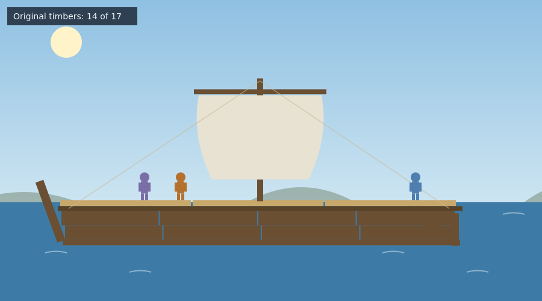
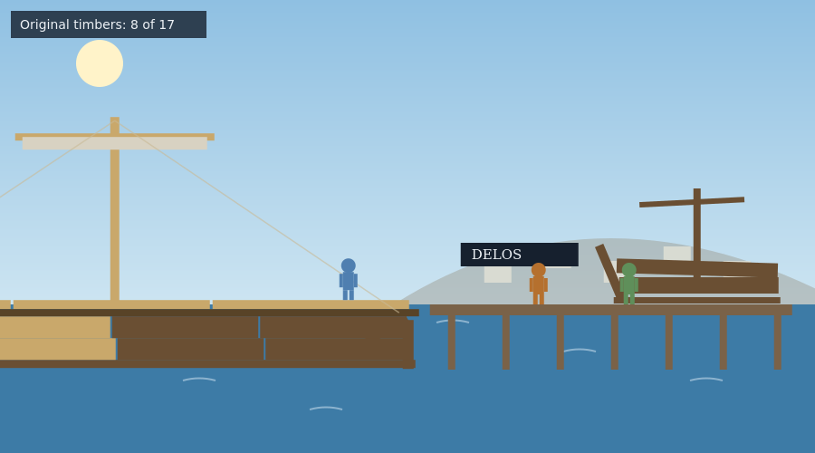

# The Ship of Theseus

A single-file browser game for introductory philosophy and humanities courses. The player, an Athenian heading home for a year of jury service, works the passage as ship's carpenter aboard the Theseus, an old wooden merchant ship crossing the Aegean from Miletus to Athens, and replaces its timbers as they fail, port by port. The ship is drawn part by part, original wood dark and new wood light, so the puzzle accumulates visibly on screen, and a ledger in the corner counts the original timbers that remain. The activity records the player's answers at five reflection stages and produces a downloadable report for submission. Everything is contained in `ship_of_theseus.html`.

A note on the timeline: the historical preserved ship was a ceremonial vessel, and this activity sails it as a working merchant ship with the player aboard. The journey compresses centuries into one story on purpose, and the map's README states the real dates.



## The voyage

Stage 0 opens on the pier at Miletus, before boarding: what makes this ship this ship, and what would have to change before you would call it a different one? The options preview the candidate answers: material, structure, name and history, crew and work.

The captain welcomes the new carpenter aboard, states the working truth of wooden ships, that you replace what fails the day it fails, and points out three soft deck planks. Repair is one press of E at a marked part: the old timber comes out, the new one goes in, the part is redrawn in new wood, and the discard joins a growing pile on the dock. When the deck is sound, a passenger asks the first version of the question, the reply is recorded, and Stage 1 asks whether three planks out of seventeen have changed anything.

The ship sails for Samos, loads cargo, and runs into a storm on the long crossing to Delos, which cracks the mast and the yard and springs four hull planks. A background box at Delos gives the puzzle its history: Plutarch reports that the Athenians preserved the actual ship of Theseus for centuries by replacing each plank as it decayed, and that philosophers already argued over whether the preserved ship was still the ship. After the storm repairs, Stage 2 asks where the line is, if anywhere: at the first plank, at half, at the last original part, or nowhere.

On the Delos pier waits the game's turn of the screw. A collector has been buying the discarded timbers at every port, and he has reassembled them, in their old order, into a second ship standing on the dock. His question is Hobbes' sharpened version of the puzzle: one vessel has the original material, the other has the continuous history, and each has a claim to the name. The exchange is recorded, a background box credits Hobbes, and Stage 3 asks which one is the Ship of Theseus, with both, neither, and it depends among the options.

Aegina brings routine repairs to the steering and hull. At Athens, with the bow post and the final plank replaced, one timber remains: the keel, the last of the original wood, and the worm has found it. The captain leaves the call to the carpenter, replace it or keep it, and the choice is recorded and reflected in the final ledger. The closing conversation then turns the puzzle on the player: a body replaces most of its material over a life, cell by cell, like planks, so whom is the captain paying? Stage 4 reopens the Stage 0 answer for ships and for selves, and keeping or changing it both earn full credit.



The end screen shows all recorded responses, three discussion questions extending the puzzle to bands, bodies, courts, and museums, a three-item quiz on Plutarch, Hobbes, and what the puzzle is about, and the downloadable report, which includes the full ledger: every part replaced in order, the count of original timbers at the end, the dockside answers, and the keel decision. On completion the game writes the key `phil_map_ship`, and the activity map's crossing stop now opens it.

## Controls

Move with the left and right arrow keys. E engages with whatever is next to you: talk to someone, or repair a damaged part. Damaged parts are darkened and marked. Dialogue replies can be clicked or chosen with number keys. On touch devices an on-screen pad appears automatically. A narration toggle reads the reflection prompts aloud, and the reduced-motion setting calms the ship's bob, the storm, and the sea.

## Deployment

```html
<p style="text-align:center;">
  <iframe src="https://YOURUSER.github.io/YOURREPO/ship-of-theseus/ship_of_theseus.html"
          width="960" height="1000"
          style="border:1px solid #ccc; border-radius:8px; max-width:100%;"
          title="The Ship of Theseus"></iframe>
</p>
```

## Editing guide

The five stage questions are the `prompts` object. The ship's seventeen parts are the `PARTS` array with their interaction positions in `PART_X`, and which parts fail at which port is set in `onArrival` and in the start button handler for Miletus. The dockside conversations are `dlgCaptain`, `dlgPassenger`, `dlgCollector`, `dlgKeel`, and `dlgClose`, with the Plutarch and Hobbes background boxes inside the Delos arrival and the collector conversation. Wood colors for original, damaged, replaced, and kept parts are in `woodColor`. The sailing time per leg is `SAIL_TIME`.

## Accessibility

Objective and status lines are announced through live regions, every interaction is reachable by keyboard, dialogue replies have number-key equivalents, touch controls appear on coarse-pointer devices, narration is available for the reflection prompts, multiple choice questions are answered with a single selection plus an optional comment, and reduced motion is respected throughout, including the storm.

## Suggested further reading

The activities themselves carry no outside links, so nothing in them can break or lead a student off task. These are for you, and for any student who wants to go further.

- [Identity Over Time](https://plato.stanford.edu/entries/identity-time/)
- [Personal Identity](https://plato.stanford.edu/entries/identity-personal/)
