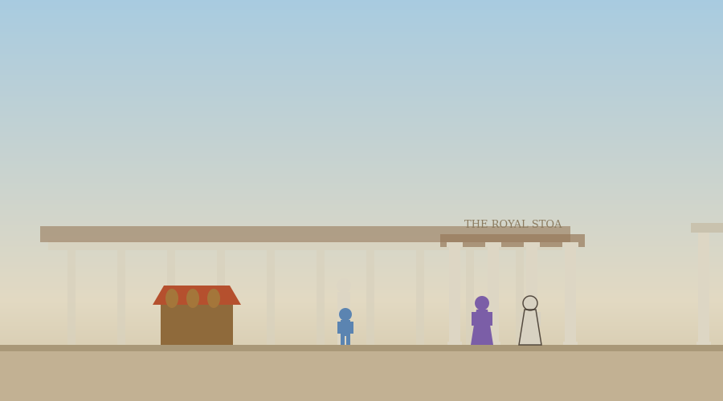
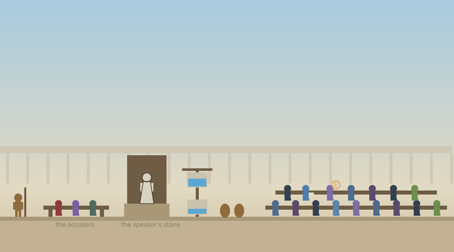

# The Trial of Socrates

A single-file walking activity set in Athens in 399 BC. The player's jury year brings its first allotment: a place on the jury of 501 that will hear the case against Socrates. The player walks to the court through the Agora, sees the method at work on the way, hears the charges and the defense adapted from Plato's Apology, and casts a real vote before the historical count is revealed. Everything is contained in `trial_of_socrates.html`.



## The morning

Stage 0 opens before anything happens: Athens allows a citizen to be prosecuted for what he teaches and asks, so should asking questions ever be a crime, and what, if anything, should a city be allowed to forbid teaching?

The walk to court passes through the Agora, past the stoa and the market stalls, to the porch of the Royal Stoa, where two men are talking. This is the Euthyphro conversation, adapted from the dialogue Plato set in this exact place on this exact morning: Euthyphro, prosecuting his own father and confident he knows what piety is, defines it as what the gods love, amends it under questioning to what all the gods love, and is then asked whether the gods love the pious because it is pious or whether it is pious because they love it. He remembers somewhere urgent to be. A background box names the Euthyphro dilemma and its continuing use against any theory that defines goodness by an authority's approval, and Stage 1 has the player run the same fork on something they consider good.

Through the gate, the herald states the indictment, corrupting the young and impiety, and directs the late juror to the one open place on the benches, and from that seat the trial advances one press of E at a time. Meletus speaks for the accusers. Socrates answers from the speaker's stone, and his defense begins with the old accusers: the comedy where a Socrates swings in a basket, which many of the jurors saw as boys, and which he can neither summon nor cross-examine. A background box states the source, Plato's Apology, where Socrates names the comedy of Aristophanes, staged twenty four years earlier, as a source of the prejudice against him. Stage 2 asks how a rumor differs from a witness as a source of belief and what a person can do to defend against one, which is the critical thinking center of the activity.

The defense continues with the oracle story and its interpretation, the gadfly comparison in Socrates' own simile, and the refusal to beg or bring his family before the jury. Then the herald calls for ballots, and the player casts one: pierced for guilt, solid for acquittal, chosen in dialogue and recorded again with a required reason at Stage 3, where the reason is graded rather than the direction. The count follows: 280 for guilt, 221 for acquittal, and a shift of 30 votes would have acquitted him.



The penalty phase gives the trial its ending. Socrates proposes free meals in the Prytaneum, tells the court that the unexamined life is not worth living for a human being and that he cannot keep silent, then names thirty minae with Plato, Crito, Critobulus, and Apollodorus standing surety. The young man on the bench who has been writing on a wax tablet all morning looks up at his own name, and the background box states plainly that this is Plato and that nearly everything the activity has quoted survives because he wrote it down. The court votes for death by a margin ancient sources report as larger than the margin for guilt, Socrates delivers his closing sentence, and Stage 4 asks whether the player agrees that the unexamined life is not worth living, and what an examined life requires and costs.

The end screen shows all responses, the juror's ballot beside the historical count in the report, three discussion questions on limits to teaching, trial by public image, and the refusal to beg, a three-item quiz, and the download. On completion the activity writes the key `phil_map_apology`. The sentence then waits a month on the sacred ship, and the next stops are the grove of Akademos and the cave, with the prison at the month's end.

## The water clock

The court is drawn with its furniture: the speaker's stone with Socrates on it, the accusers' bench, the ballot urns, the jury benches with the player seated among them, and the klepsydra, the water clock that timed Athenian speeches, which visibly drains as the trial's phases pass.

## Deployment

```html
<p style="text-align:center;">
  <iframe src="https://YOURUSER.github.io/YOURREPO/trial/trial_of_socrates.html"
          width="960" height="1000"
          style="border:1px solid #ccc; border-radius:8px; max-width:100%;"
          title="The Trial of Socrates"></iframe>
</p>
```

## Editing guide

The five stage questions are the `prompts` object. The Euthyphro conversation is `dlgEuthyphro`, and the trial is the sequence `dlgProsecution`, `dlgOldAccusers`, `dlgDefense`, `dlgVote`, `dlgPenalty`, and `dlgClose`, advanced by `nextCourtStep` from the juror's place. The vote is recorded twice: the ballot choice in the dialogue and the official record with its reason at the Stage 3 prompt. The water clock's level is driven by `trialPhase`.

## Accessibility

Objective and status lines are announced through live regions, everything is reachable by keyboard, dialogue replies have number-key equivalents, touch controls appear on coarse-pointer devices, narration is available for the reflection prompts, multiple choice questions are answered with a single selection plus an optional comment, and reduced motion is respected.

## Suggested further reading

The activities themselves carry no outside links, so nothing in them can break or lead a student off task. These are for you, and for any student who wants to go further.

- [Plato, Apology, full text (Project Gutenberg)](https://www.gutenberg.org/ebooks/1656)
- [Socrates](https://plato.stanford.edu/entries/socrates/)
